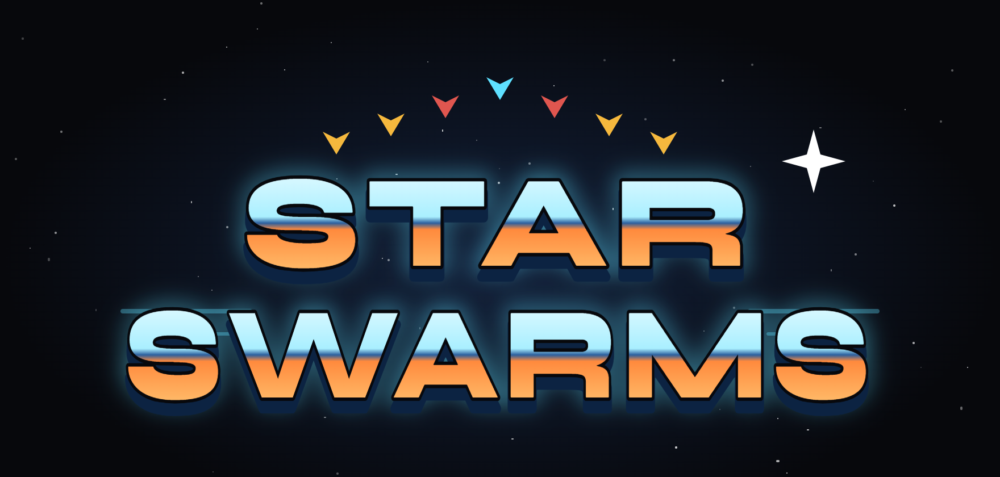

<p align="center">
  
</p>

<p align="center"><em>Built with a swarm.</em></p>

# Star Swarms

A Galaga-style arcade shooter that runs in the browser. Break the formation,
dodge the dive-bombers, and win your captured fighter back from the flagship's
tractor beam.

Built with React, TanStack Start, Vite and Tailwind, with the game itself drawn
on an HTML canvas. It plays on desktop and mobile.

## How to play

| Action | Keyboard | Touch |
| --- | --- | --- |
| Move | ← → or A / D | ‹ › buttons |
| Fire | Space, Z or K | Fire button |
| Pause | P or Esc | Pause button |
| Mute | M | Speaker button |

- **Enemies:** wasps (gold), moths (red) and commanders (teal). Commanders take
  two hits. Every enemy is worth more if you shoot it while it's diving at you.

  | Enemy | In formation | Diving |
  | --- | --- | --- |
  | Wasp | 50 | 100 |
  | Moth | 80 | 160 |
  | Commander | 150 | 400 |

- **Captured fighter:** a commander's tractor beam can capture your ship. Shoot
  the commander holding it, then catch your fighter as it falls. You'll fly a
  dual fighter with double the firepower (and a bigger target).
- **Challenge stages:** every 4th stage. Enemies don't shoot, and hitting every
  one of them earns a **10,000 point** perfect bonus.
- **Extra lives:** at 20,000 points, then every 50,000 after that.
- Your high score and mute setting are saved in the browser.

## Running locally

You need [Node.js](https://nodejs.org/) 22 or newer.

```bash
npm install
npm run dev
```

Then open <http://localhost:8080>.

| Command | What it does |
| --- | --- |
| `npm run dev` | Start the dev server with hot reload on port 8080 |
| `npm run build` | Build for production |
| `npm run preview` | Serve the production build on port 8081 |
| `npm run typecheck` | Check TypeScript types |
| `npm run lint` | Run ESLint |

## Project layout

```
src/
  game/                 The game engine (plain TypeScript, no React)
    game.ts             Game loop, enemy formation and dive paths, collisions, scoring
    input.ts            Keyboard, pointer and touch controls
    audio.ts            Sound effects
    sprites.ts          Sprite loading and drawing
    hud.ts              Score/lives state shared with the React UI
    save.ts             High score saved to localStorage
    constants.ts        Playfield size, speeds and point values
  components/game/
    StarSwarm.tsx       Canvas, HUD, title/pause/game-over screens, touch buttons
    Logo.tsx            Animated Star Swarms logo (SVG)
  routes/               Page routes (TanStack Router)
public/sprites/         Sprite images used by the game
assets/sprites/         Source art for the sprites
```

This project began in Grok App Builder, so it still includes some unused
scaffolding from that tool: sign-in and database helpers in `src/lib/`, the
`.grok/` folder and `AGENTS.md`. The game doesn't depend on any of it.
Sign-in is switched off in `.grok/app-env.json`, which the build reads, so keep
that file.
